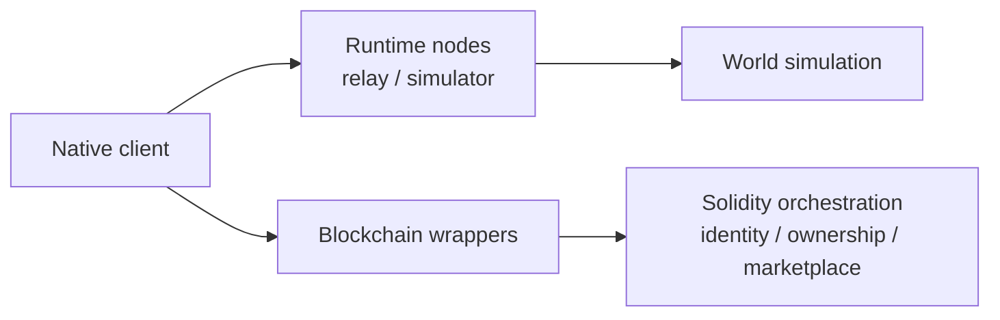

# OpenRealm

OpenRealm is a local-first voxel world stack that combines a native client, runtime node network, and Ethereum-compatible orchestration layer for identity, ownership, and marketplace state.

It is built for worlds that want fast native simulation, explicit ownership rules, and a cleaner boundary between live gameplay and durable economic state.



## What OpenRealm includes

- A native C++20 voxel client with rendering, input, audio, menus, and local world interaction
- Headless relay and simulator targets for runtime networking and world execution
- ENet-based runtime sessions for bootstrap, topology exchange, and player snapshot replication
- Solidity contracts for player identity, chunk claims, delegated editing, listings, auctions, and protocol parameters
- JavaScript tooling for contract build, test, and deployment flows
- Realm-specific wrappers for local smoke deployment and main-network deployment

## Architecture

OpenRealm is organized around three layers:

- Client layer
  - windowed gameplay, rendering, menus, audio, and player-facing UX
- Runtime layer
  - relay/simulator processes, node discovery, session bootstrap, topology exchange, and live replication
- Orchestration layer
  - player identity, chunk ownership, delegated editing permissions, listings, auctions, and deployment records

This split keeps simulation close to the game while moving slower, durable world rules into a separate orchestration surface.

## Quick start

### Native build

OpenRealm uses `bbs` for native builds.

```bash
bbs info project
bbs build -t openrealm_client
bbs build -t openrealm_node_launcher
```

### Orchestration workspace

The orchestration workspace lives under `blockchain/`.

```bash
cd blockchain
npm install
npm run verify
```

That command rebuilds the contract artifacts and runs the current Mocha suite.

## Realms and deployment

OpenRealm currently ships with two realm configurations:
- `realms/test`
- `realms/main`

The test realm includes local Ganache helpers and smoke-deploy wrappers. The main realm includes the deployment wrapper used for configured network deployments.

Useful commands:

```bash
cd blockchain
npm run ganache:test
npm run deploy:test:local
npm run deploy:main
```

## Native targets

The native repo currently exposes four main targets:

- `openrealm_client`
  - playable windowed client
- `openrealm_relay`
  - headless relay/runtime node
- `openrealm_simulator`
  - headless simulation/runtime node
- `openrealm_node_launcher`
  - local multi-process launcher for relay/simulator sessions

## Development notes

- Native build definitions live in `project.bbs`.
- The orchestration workspace has CI and deployment workflows in `.github/workflows/`.
- Root `AGENTS.md` and `CLAUDE.md` point to the internal `.agents/` repo guide used for agent-facing maintenance notes.

## License

OpenRealm is licensed under the MIT License. See `LICENSE`.
