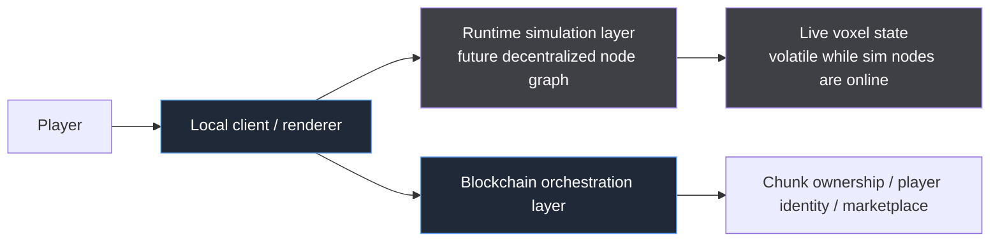
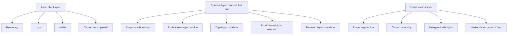
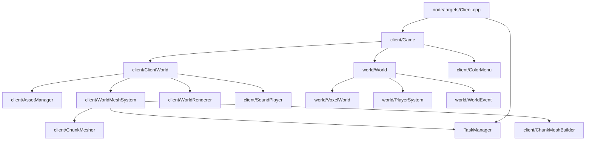
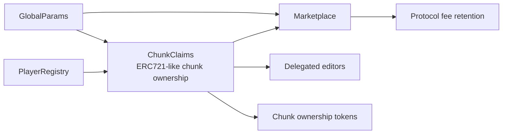

# OpenRealm

OpenRealm is a C++20 voxel game prototype aimed at a future **serverless, decentralized voxel world**.

Today, this repository primarily contains the **local engine/client foundation**:
- real-time game loop
- local voxel storage and editing
- player simulation and collision
- asynchronous chunk meshing
- raylib-based rendering and audio

It also now contains a separate `blockchain/` workspace for the early **orchestration layer**: wallet-linked player registration, NFT-backed chunk claims, and marketplace logic.

> The decentralized multiplayer runtime is still early and incomplete, but the repo now contains a first real node-to-node runtime cut: ENet transport, explicit world-position joins, topology snapshots, proximity-based neighbor selection, and remote player snapshot replication. It is still not a full peer-to-peer game or consensus layer.

## High-level architecture



### Separation of concerns



## Current code architecture

### Native client/runtime foundation



### Blockchain workspace



## Repository layout

### Root node/client code
- `node/targets/` — executable entry points for client, simulator, and relay node types
- `node/targets/Client.cpp` — client node entrypoint; creates the shared `TaskManager` and starts `Game`
- `node/targets/Simulator.cpp` — simulator node entrypoint for headless world simulation plus the new runtime-session loop
- `node/targets/Relay.cpp` — relay node entrypoint for topology bootstrap / relay participation in the runtime graph
- `node/client/` — app shell, rendering, input glue, asset/audio caches, meshing, HUD/UI
- `node/world/` — headless simulation-side world systems, voxel data, player system, world events
- `node/runtime/` — runtime transport, topology/session state, packet serialization, and config loading
- `node/cli/` — legacy non-client node TUI; no longer part of the default relay/simulator build path

- `node/TaskManager.*` — generic background worker queue
- `assets/` — shaders and sounds used at runtime

### Blockchain orchestration workspace
- `blockchain/contracts/` — Solidity contracts for global params, registry, chunk claims, and marketplace
- `blockchain/test/` — Mocha + Ganache contract tests
- `blockchain/scripts/` — artifact generation and deployment scripts
- `blockchain/specs/` — orchestration-layer notes/specs
- `blockchain/README.md` — detailed workflow for the blockchain subproject

## Design principles

- **Local playability first** — the current code should stay easy to run and iterate on locally
- **World logic stays headless-friendly** — `node/world/` should remain usable without graphics/audio ownership
- **Client state stays client-side** — render/upload state should not leak back into world simulation POD data
- **Asynchronous chunk meshing stays intact** — world edits are immediate; mesh generation remains backgrounded
- **Blockchain stays low-frequency** — ownership, registration, and market operations belong there; real-time gameplay does not

## Build and run

## Native app (`bbs`)

This repo uses [`bbs`](https://github.com/luppichristian/bbs) as the primary build frontend.

From the repository root:

```bash
bbs build
bbs run -t openrealm_client
```

Useful commands:

```bash
bbs info project
bbs update --init-toolchain
bbs build -t openrealm_client
bbs build -t openrealm_simulator
bbs build -t openrealm_relay
bbs build -t openrealm_node_launcher
```

Example multi-node local runtime session:

```bash
bbs run -t openrealm_node_launcher -a --realm test --relays 1 --simulators 2 --run-seconds 5
```

The current runtime model is:
- jump nodes are network bootstrap points only
- clients/simulators join around an explicit world target position
- nodes exchange topology snapshots and keep only nearby neighbors
- remote players are replicated through player snapshots

### Native dependencies
- `raylib`
- `tracy`
- `cpp-httplib`
- `nlohmann/json`

The current native runtime stack uses:
- ENet for binary node-to-node packets
- explicit runtime packets for handshake, join requests/responses, topology snapshots, and player snapshots
- `cpp-httplib` + `nlohmann/json` only for blockchain JSON-RPC

These are declared in `project.bbs`.

## Blockchain workspace

From `blockchain/`:

```bash
npm install
npm run build
npm test
```

For a local deployment against Ganache:

```bash
node realms/test/start-ganache-local.js
node realms/test/deploy-local.js [private-key] [owner-address]
```

If you prefer to stay inside the blockchain workspace, the equivalent helpers are `npm --prefix blockchain run ganache:test` and `npm --prefix blockchain run deploy:test:local`.

If you prefer the raw JavaScript entrypoint, you can still run `node realms/test/deploy.js --private-key <private-key> --owner <owner-address>` directly.

For a main/real deployment using the realm-specific wrapper:

```bash
node realms/main/deploy.js --rpc <production-rpc-url> --private-key <private-key> --owner <owner-address>
```

See [`blockchain/README.md`](blockchain/README.md) for the full contract workflow.

## Formatting

### C++
The native codebase follows the repository's `.clang-format`:
- 2-space indentation
- Allman braces
- no include sorting
- pointer style `Type* name`

### Solidity
**No, `clang-format` is not the right formatter for Solidity.**

For Solidity we should use a Solidity-aware formatter instead, such as:
- `forge fmt`
- `prettier` with `prettier-plugin-solidity`

I have **not** wired a Solidity formatter into the repo in this change, but that would be the right next step if you want one.

## Long-term direction

The target architecture is roughly:
1. keep strengthening the local client/runtime split
2. expand the current world-position runtime into full chunk/world replication
3. add stronger topology walking, authority, and edit propagation
4. add region-of-interest chunk state networking and ownership-aware simulation
5. connect runtime permissions to blockchain-backed ownership and identity

## Status

Current implementation is strongest in:
- local voxel engine/client foundations
- local meshing/rendering architecture
- initial NFT-backed orchestration-layer contracts and tests

Still future work:
- chunk/voxel replication across nodes
- stronger topology walking / discovery refinement
- authoritative chunk simulation across multiple nodes
- real gameplay integration with wallet/ownership flows
